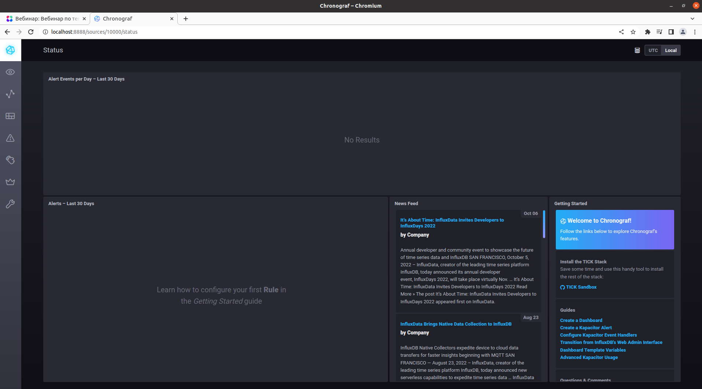
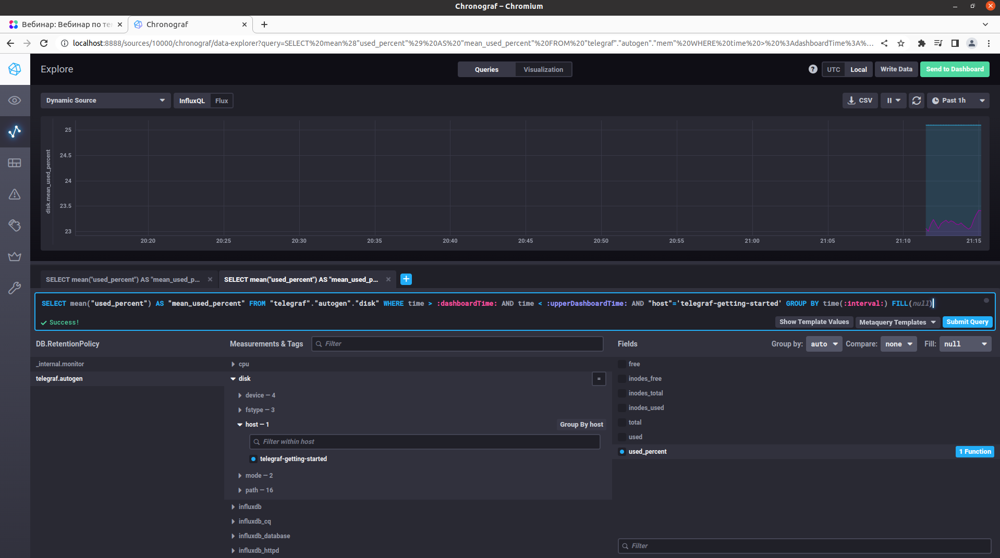
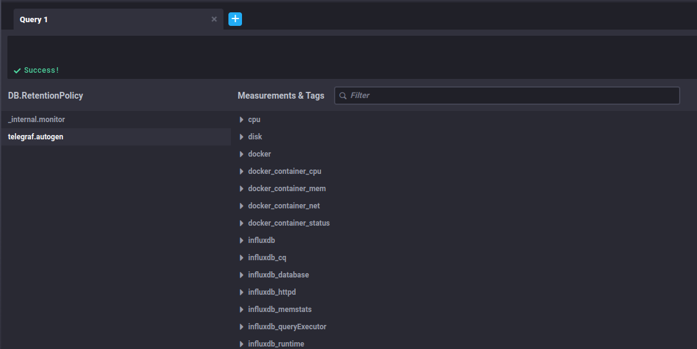

## 1.

push-системы (плюсы):
	
	-Возможность получить данные мониторинга даже если хост не всегда доступен по сети
	-Простой ввод в эксплуатацию
	-Отправка данных с хоста на несколько систем мониторинга
	-Возможность тонкой настройки каждого хоста
	
push-системы (минусы):

	-Необходимость настройки мониторинга на каждом хосте
	-Вероятность потери метрик от хоста, так как нет проверки доставки данных
	-Есть риск утечки данных при перехвате данных мониторинга
	-Вероятность возникновения очереди на принимающей стороне в случае отправки множества данных, либо загруженности принимающей системы
	
pull-системы (плюсы):
	
	-Централизованное управление мониторингом
	-Удобная настройка опрашивания агентов на хостах
	-Низкая вероятность утечки данных
	-Доставка данных гарантируется
	
pull-системы (минусы):
	
	-Требовательность к ресурсам
	-БОльшая нагрузка на сеть по сравнению push-системами
	
## 2.
	
push-системы - TICK
	
pull-системы - Nagios
	
Гибридные системы - Prometheus, Zabbix, VictoriaMetrics

## 3.

```
eugene@eugene-Latitude-5491:~/git/sandbox$ curl http://localhost:8086/ping -v
*   Trying 127.0.0.1:8086...
* TCP_NODELAY set
* Connected to localhost (127.0.0.1) port 8086 (#0)
> GET /ping HTTP/1.1
> Host: localhost:8086
> User-Agent: curl/7.68.0
> Accept: */*
> 
* Mark bundle as not supporting multiuse
< HTTP/1.1 204 No Content
< Content-Type: application/json
< Request-Id: e741143d-5227-11ed-8079-0242ac120003
< X-Influxdb-Build: OSS
< X-Influxdb-Version: 1.8.10
< X-Request-Id: e741143d-5227-11ed-8079-0242ac120003
< Date: Sat, 22 Oct 2022 16:38:05 GMT
< 
* Connection #0 to host localhost left intact
```

```
eugene@eugene-Latitude-5491:~/git/sandbox$ curl http://localhost:8888
<!DOCTYPE html><html><head><link rel="stylesheet" href="/index.c708214f.css"><meta http-equiv="Content-type" content="text/html; charset=utf-8"><title>Chronograf</title><link rel="icon shortcut" href="/favicon.70d63073.ico"></head><body> <div id="react-root" data-basepath=""></div> <script type="module" src="/index.e81b88ee.js"></script><script src="/index.a6955a67.js" nomodule="" defer></script> </body></html>
```
	
```
eugene@eugene-Latitude-5491:~/git/sandbox$ curl http://localhost:9092/kapacitor/v1/ping -v
*   Trying 127.0.0.1:9092...
* TCP_NODELAY set
* Connected to localhost (127.0.0.1) port 9092 (#0)
> GET /kapacitor/v1/ping HTTP/1.1
> Host: localhost:9092
> User-Agent: curl/7.68.0
> Accept: */*
> 
* Mark bundle as not supporting multiuse
< HTTP/1.1 204 No Content
< Content-Type: application/json; charset=utf-8
< Request-Id: fe13a42d-5227-11ed-8069-0242ac120004
< X-Kapacitor-Version: 1.6.5
< Date: Sat, 22 Oct 2022 16:38:43 GMT
< 
* Connection #0 to host localhost left intact
```



## 4.
	
Так как данные метрики отсутствовали для их отображения я добавил в файл telegraf.conf

```
[[inputs.disk]]
[[inputs.mem]]
```


## 5.

