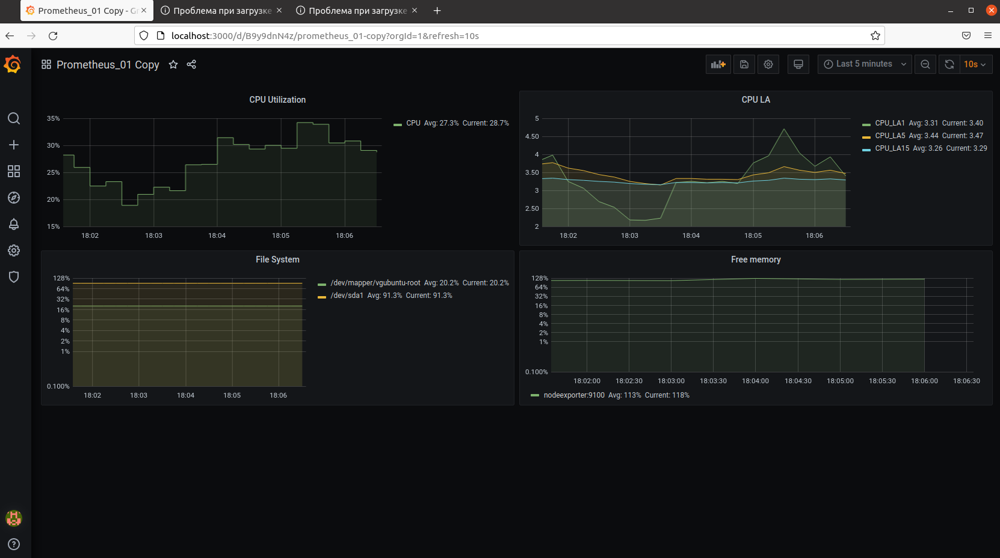

## Задание 1


## Задание 2

Утилизация CPU для nodeexporter (в процентах, 100-idle)
```
100 - (avg by (instance) (rate(node_cpu_seconds_total{job="nodeexporter",mode="idle"}[1m])) * 100)
```
CPULA 1/5/15
```
node_load1
node_load5
node_load15
```
Количество свободной оперативной памяти
```
node_memory_Inactive_bytes/node_memory_MemAvailable_bytes*100
```
Количество места на файловой системе
```
node_filesystem_avail_bytes{fstype!~"tmpfs|fuse.lxcfs|squashfs"} / node_filesystem_size_bytes{fstype!~"tmpfs|fuse.lxcfs|squashfs"}*100
```


## Задание 3


## Задание 4
Ссылка на json file

https://github.com/Phenom-55/devops-netology/blob/main/10/conf.json
