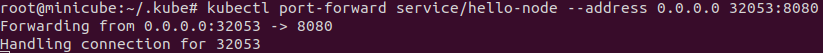

## Задача 1: Установить Minikube
Использовал YCloud для разворачивания

К существующему, дополнительно устанавливал или исполнял:
- Sudo apt-get install -y conntrack
- Сri-dockerd
- Сri-tools
- sudo sysctl fs.protected_regular=0 
- Использовал драйвер Docker при запуске

## Задача 2: Запуск Hello World

Развернул через Minikube тестовое приложение

Установил аддоны ingress и dashboard

## Задача 3: Установить kubectl
Подключиться к minikube

Создал новую ВМ в YCloud в той же подсети и установил утилиту kubectl.
К сожалению, не удалось настроить подключение с кластером. Долго промучился, но безрезультатно(
Машины по локальной сети друг друга видели. На машину manager с kubectl скопировал содержимое ~/.kube/config и связанных сертификатов c машины с кластером. Пробовал разные IP задавать в конфиг файле.
Еще нашел информацию, что нужно запускать кластер с параметром "--apiserver-ips", сделал - но также не дало результатов. Ниже привожу скриншот об ошибке.

Проверить работу приложения из задания 2, запустив port-forward до кластера

P.S.: надеюсь на снисхождение, потому что машины в яндексе уже уничтожены, наверно лучше было делать у себя на ПК в VirtualBox, чтобы можно было снова все завести.

