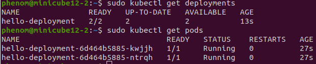
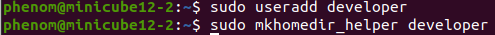
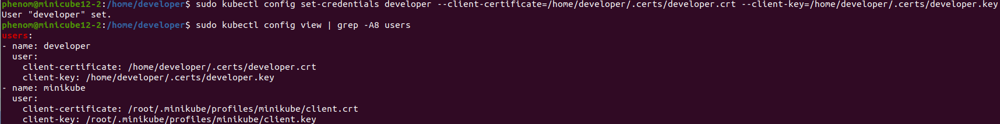
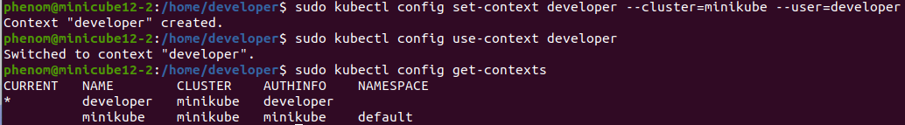
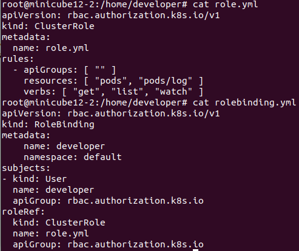
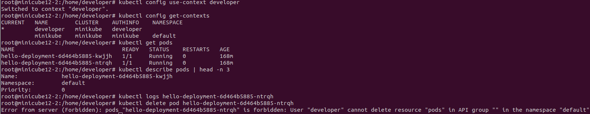
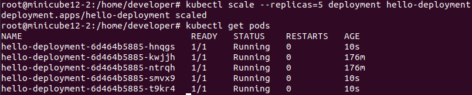

## Задача 1: Запуск пода из образа в деплойменте

Развернул новый hello-deployment указав 2 реплики:



## Задача 2: Просмотр логов для разработки


Создаю пользвателя:



Создаем сертификат пользователя и подписываем его удостоверяющим центором куберф, а после помещаем его в директорию нового пользователя:

````
phenom@minicube12-2:~$ cd /home/developer
phenom@minicube12-2:/home/developer$ sudo openssl genrsa -out developer.key 2048
phenom@minicube12-2:/home/developer$ sudo openssl req -new -key developer.key -out developer.csr -subj "/CN=developer"
phenom@minicube12-2:/home/developer$ sudo openssl x509 -req -in developer.csr -CA /root/.minikube/ca.crt -CAkey /root/.minikube/ca.key -CAcreateserial -out developer.crt -days 500
phenom@minicube12-2:/home/developer$ sudo mkdir .certs
phenom@minicube12-2:/home/developer$ sudo mv developer.crt developer.key .certs
phenom@minicube12-2:/home/developer$ sudo chown -R phenom: /home/developer/.certs
````


Добавляем сертификаты в конфиг kubectl:



Добавляем контекст для работы с данным пользователем:



Создаем yaml файлы с правами нового пользователя и выполняем команды:


````
root@minicube12-2:/home/developer# kubectl apply -f role.yml
root@minicube12-2:/home/developer# kubectl apply -f rolebinding.yml
````
Итог:




## Задача 3: Изменение количества реплик

С помощью kubectl scale меняем количество подов на 5:

