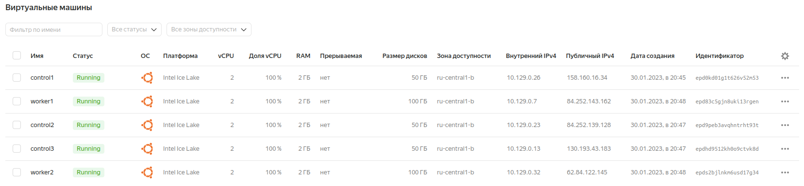
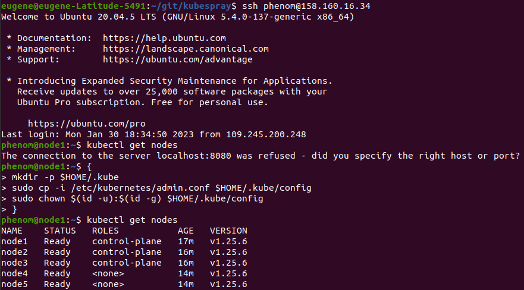

## Задание 1: Подготовить инвентарь kubespray

Моя конфигурация - 3 мастер ноды и 2 воркера.

Хар-ки мастера - 2CPU, 2GB RAM, 50GB HDD

Хар-ки воркера - 2CPU, 2GB RAM, 100GB HDD

Подготовил ВМ в YCloud:

Подготовил файл hosts.yaml:

https://github.com/Phenom-55/devops-netology/blob/main/12/hosts.yaml

## Задание 2 (*): подготовить и проверить инвентарь для кластера в YCloud

Развернул инфраструктуру кубера в YCloud согласно конфигурации:

