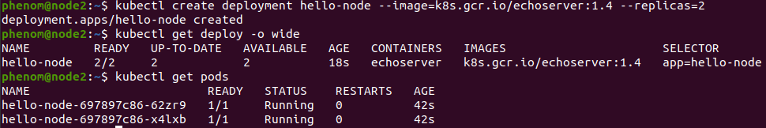
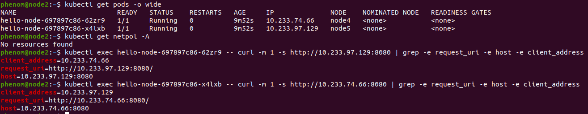

## Задание 1: установить в кластер CNI плагин Calico

Создал ВМ в YCloud:

Развернул кластер в YCloud с помощью Kubespray:

.png)

Развернул 2 пода hello-node в деплойменте hello-node:

Создал службу для доступа из вне:

Проверим политики, доступ с пода на под и доступ из вне.

Доступ с пода на под:

Доступ снаружи:

Создаю файлы политик default-ingress-deny.yml и pods-on-pod-ingress.yml:

Применяем политики:

 
Проверяем доступ с пода на под и снаружи после применения правил:

## Задание 2: изучить, что запущено по умолчанию

Установить утилиту calicoctl и получить 3 вышеописанных типа в консоли:

