## Подготовка:

Создаем репозитории в Docker hub:
````
eugene@eugene-Latitude-5491:~/git/devkub-homeworks/13-kubernetes-config/backend$ sudo docker build -t sinyakovnetology/backend:1.0.0 .
eugene@eugene-Latitude-5491:~/git/devkub-homeworks/13-kubernetes-config/backend$ sudo docker push sinyakovnetology/backend:1.0.0
eugene@eugene-Latitude-5491:~/git/devkub-homeworks/13-kubernetes-config/frontend$ sudo docker build -t sinyakovnetology/frontend:1.0.0 .
eugene@eugene-Latitude-5491:~/git/devkub-homeworks/13-kubernetes-config/frontend$ sudo docker push sinyakovnetology/frontend:1.0.0
````
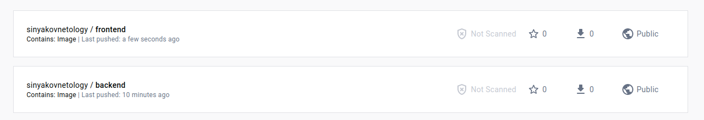

Развернул кластер в YCloud с помощью kubespray:

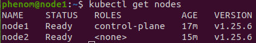

## Задание 1: Подготовить тестовый конфиг для запуска приложения

Создаем файлы deployment.yml и statefulSet.yml:

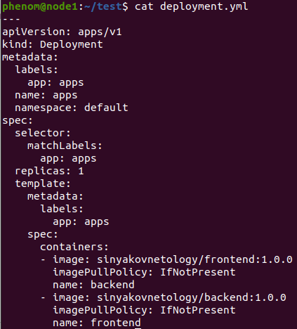

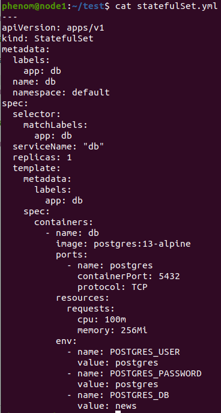

Применяем их:

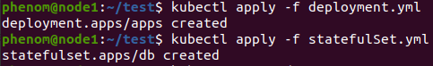

Итог:

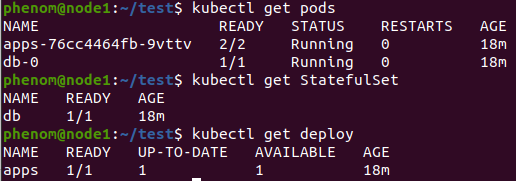


## Задание 2: Подготовить конфиг для production окружения

Создаем файлы backend.yml, frontend.yml и database.yml:

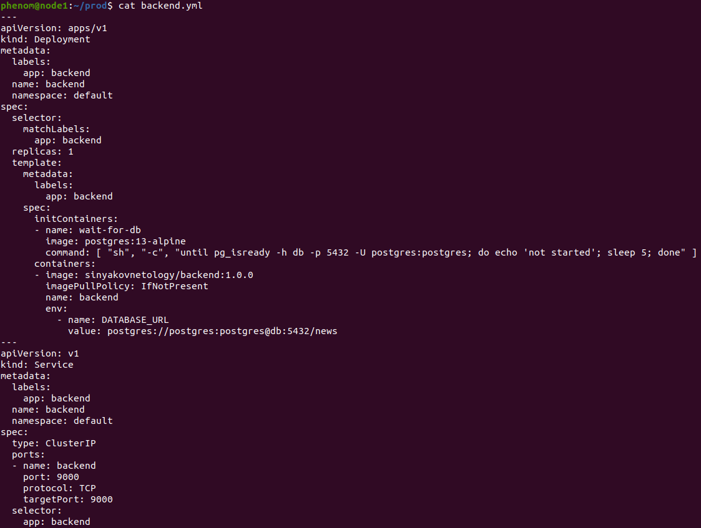

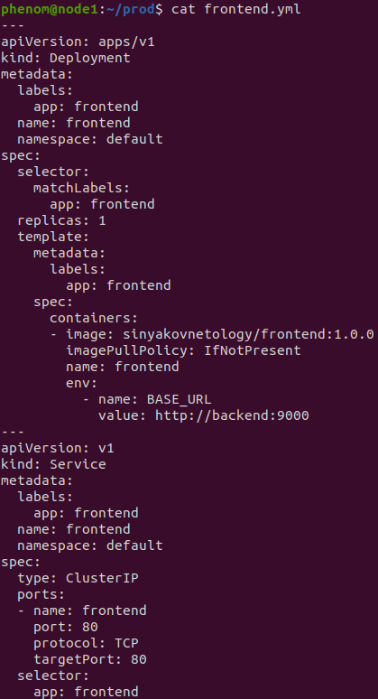

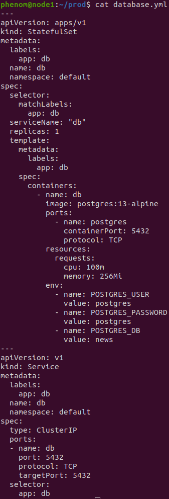

Применяем их:

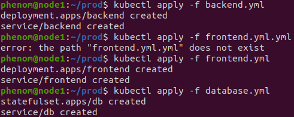

Итог:

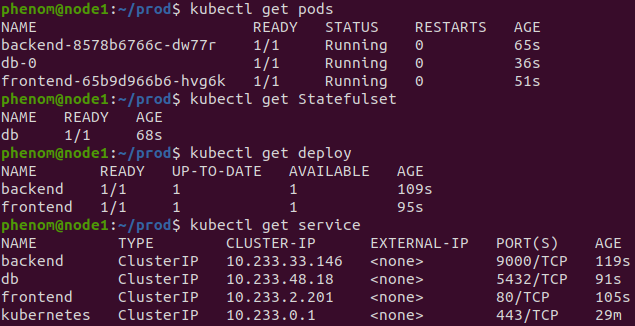
