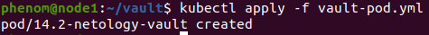
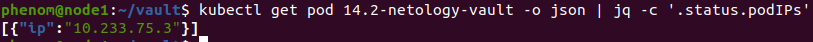
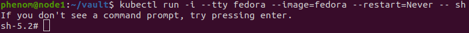
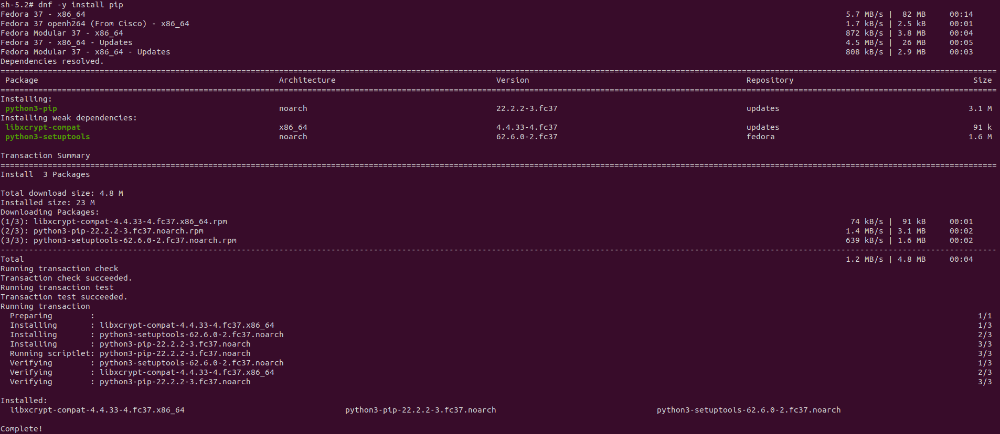
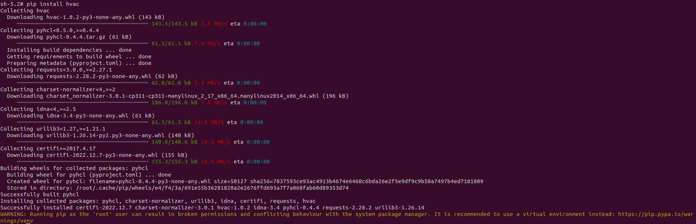
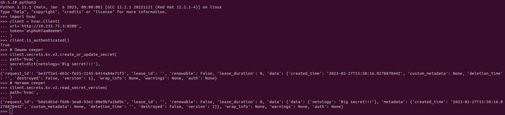

## Задача 1: Работа с модулем Vault

Запустить модуль Vault конфигураций через утилиту kubectl в установленном minikube:

Получить значение внутреннего IP пода:

Перед выполнением команды понадобилось установить утилиту jq

Запустить второй модуль для использования в качестве клиента:

Установить дополнительные пакеты:

Запустить интепретатор Python и выполнить следующий код, предварительно поменяв IP и токен:

