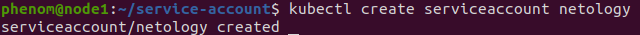
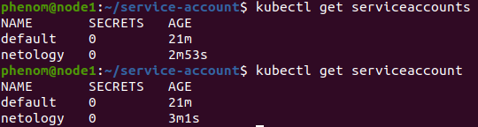
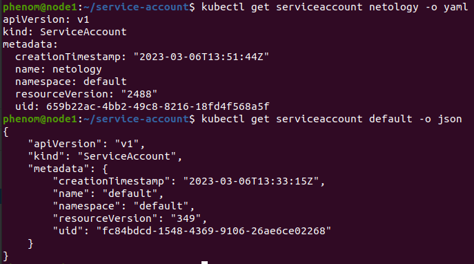
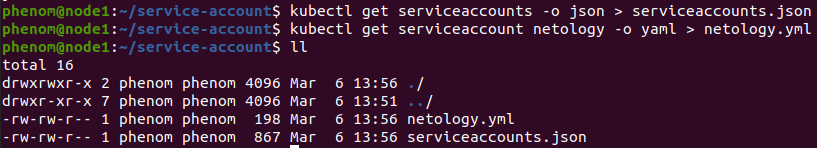
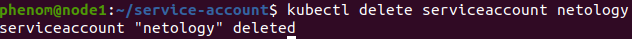
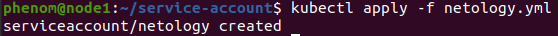

## Работа с сервис-аккаунтами через утилиту kubectl в установленном minikube

### Как создать сервис-аккаунт?

```
kubectl create serviceaccount netology
```

### Как просмотреть список сервис-акаунтов?

```
kubectl get serviceaccounts
kubectl get serviceaccount
```

### Как получить информацию в формате YAML и/или JSON?

```
kubectl get serviceaccount netology -o yaml
kubectl get serviceaccount default -o json
```

### Как выгрузить сервис-акаунты и сохранить его в файл?

```
kubectl get serviceaccounts -o json > serviceaccounts.json
kubectl get serviceaccount netology -o yaml > netology.yml
```

### Как удалить сервис-акаунт?

```
kubectl delete serviceaccount netology
```

### Как загрузить сервис-акаунт из файла?

```
kubectl apply -f netology.yml
```

## Результат

Создаем сервис-аккаунт:



Просматриваем список сервис-аккаунтов:



Получаем информацию в формате YAML и/или JSON:



Выгружаем сервис-акаунты и сохраняем его в файл:



Удаляем сервис-акаунт:



Загружаем сервис-акаунт из файла:

