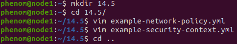
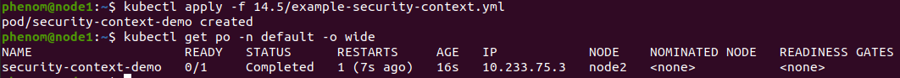
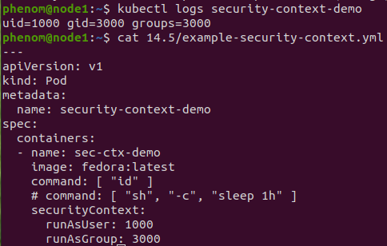

# Домашнее задание к занятию "14.5 SecurityContext, NetworkPolicies"

## Задача 1: Рассмотрите пример 14.5/example-security-context.yml

Создайте модуль

```
kubectl apply -f 14.5/example-security-context.yml
```

Проверьте установленные настройки внутри контейнера

```
kubectl logs security-context-demo
uid=1000 gid=3000 groups=3000
```

## Результат

Создаем модуль:





Проверяем установленные настройки внутри контейнера:



Идентификаторы пользователя и группы совпадают