## Задание 1. Яндекс.Облако (обязательное к выполнению)

1. Создать VPC.
- Создать пустую VPC. Выбрать зону.
2. Публичная подсеть.
- Создать в vpc subnet с названием public, сетью 192.168.10.0/24.
- Создать в этой подсети NAT-инстанс, присвоив ему адрес 192.168.10.254. В качестве image_id использовать fd80mrhj8fl2oe87o4e1
- Создать в этой публичной подсети виртуалку с публичным IP и подключиться к ней, убедиться что есть доступ к интернету.
3. Приватная подсеть.
- Создать в vpc subnet с названием private, сетью 192.168.20.0/24.
- Создать route table. Добавить статический маршрут, направляющий весь исходящий трафик private сети в NAT-инстанс
- Создать в этой приватной подсети виртуалку с внутренним IP, подключиться к ней через виртуалку, созданную ранее и убедиться что есть доступ к интернету

Resource terraform для ЯО
- [VPC subnet](https://registry.terraform.io/providers/yandex-cloud/yandex/latest/docs/resources/vpc_subnet)
- [Route table](https://registry.terraform.io/providers/yandex-cloud/yandex/latest/docs/resources/vpc_route_table)
- [Compute Instance](https://registry.terraform.io/providers/yandex-cloud/yandex/latest/docs/resources/compute_instance)

## Результат

Создал конфиг для terraform, в котором указал:

1) Создал NAT-инстанс (node1.tf) и присвоил ему IP 192.168.10.254
2) Создал ВМ для сети public - node2.tf
3) Создал ВМ для сети private - node3.tf без доступа к интернету
4) Создал файл network.tf:

    Создается пустой VPC

    Создается subnet - public, с сетью 192.168.10.0/24
    
    Создается subnet - private, с сетью 192.168.20.0/24.
    
    Создается route table и добавляется статический маршрут, направляющий весь исходящий трафик private сети в NAT-инстанс
5) Указываем образ для NAT-инстанса, а также его статический IP в файле - variables.tf

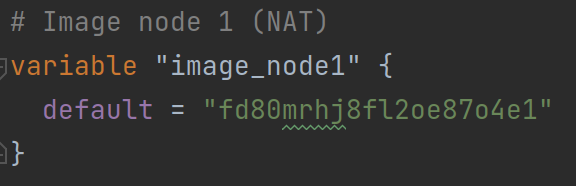

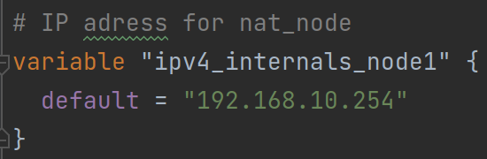

Проверяем terraform:

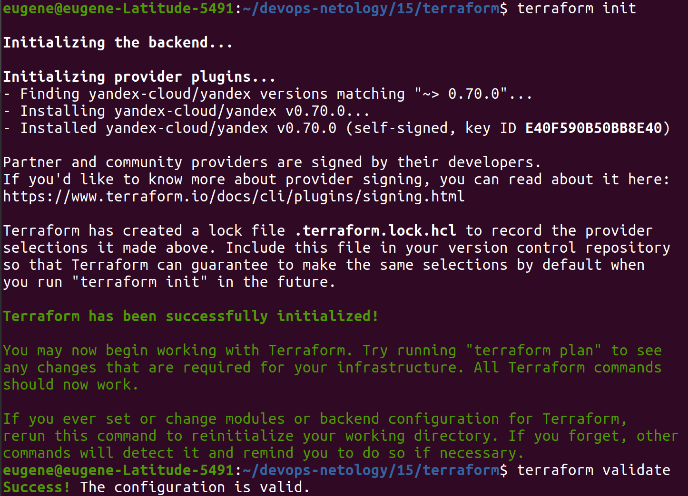

Выполняем terraform apply:

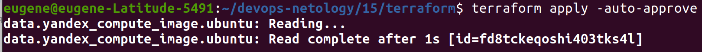

Созданы сети в Ycloud:

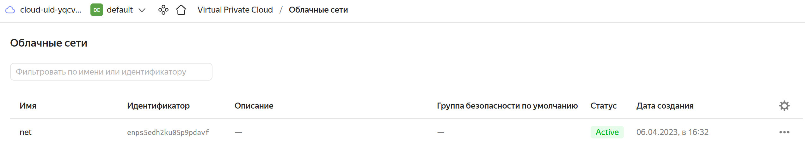

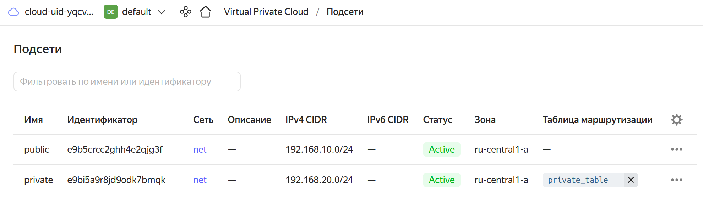

Созданы ВМ в Ycloud:

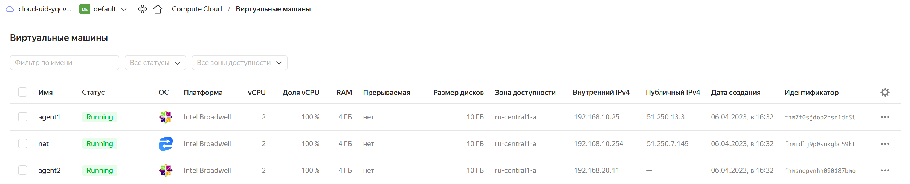

Создана таблица маршрутов:

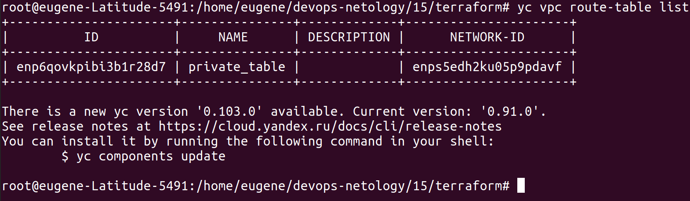

### Проверяем трафик

Подключаемся к agent1 и проверяем ping ya.ru:

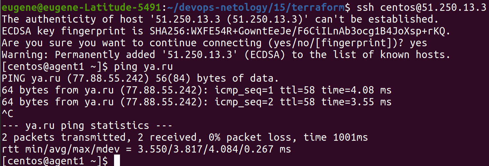

Передаем на agent1 свой приватный ключ, для того чтобы подключиться с agent1 на agent2 по внутреннему IP:

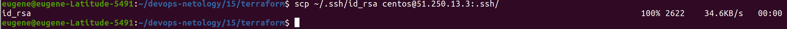

Делаем ssh с agent1 на agent2 по локальному IP и проверяем ping до ya.ru:

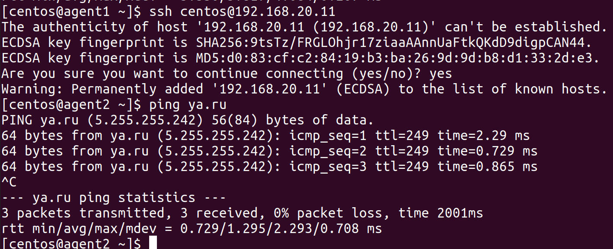

