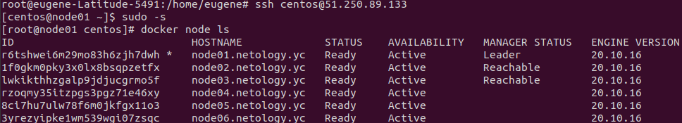
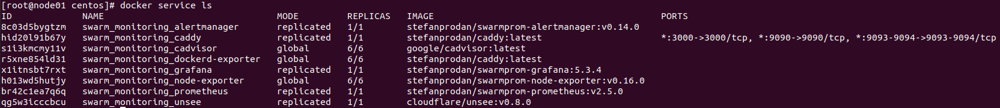

    Задача 1.
В чём отличие режимов работы сервисов в Docker Swarm кластере: replication и global? (в режиме работы global сервис запускается на всех нодах кластера, а в режиме replication - на том количестве нод, которое укажет администратор)

Какой алгоритм выбора лидера используется в Docker Swarm кластере? (Ноды manager используют алгоритм Raft для управления состоянием кластера. Лидер менеджер меняется на лету в случае выхода из строя существующего лидера, либо с ним наблюдаются проблемы)

Что такое Overlay Network? (OverlayNetwork - распределенная сеть между несколькими нодами демона Docker. Находится поверх основной сетевой инфраструктуры. Позволяет обмениваться информацией контейнерам с включенным шифрованием. В рамках такой сети маршрутизация осуществляется самим Docker)                                                                               
                              
    Задача 2.
Создать ваш первый Docker Swarm кластер в Яндекс.Облаке
Для получения зачета, вам необходимо предоставить скриншот из терминала (консоли), с выводом команды: docker node ls

    Задача 3.
Создать ваш первый, готовый к боевой эксплуатации кластер мониторинга, состоящий из стека микросервисов.
Для получения зачета, вам необходимо предоставить скриншот из терминала (консоли), с выводом команды: docker service ls

