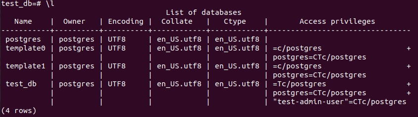
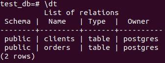
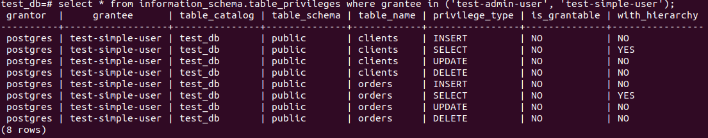
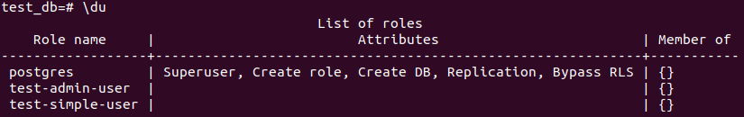
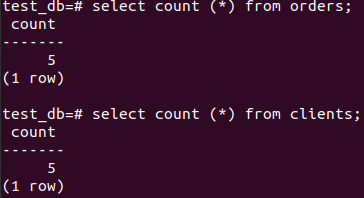
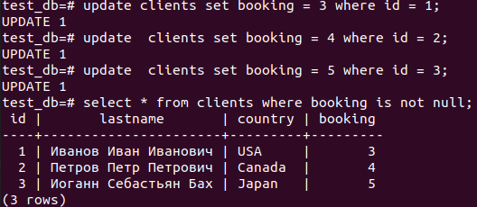
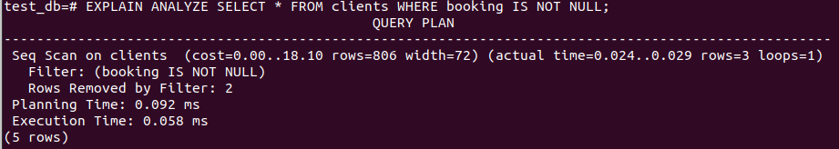

    Задача 1.
eugene@eugene-Latitude-5491:~/docker$ sudo docker pull postgres:12

eugene@eugene-Latitude-5491:~/docker$ sudo docker volume create vol1

eugene@eugene-Latitude-5491:~/docker$ sudo docker volume create vol2

eugene@eugene-Latitude-5491:~/docker$ sudo docker run --name pg-docker -e POSTGRES_PASSWORD=postgres -ti -p 5432:5432 -v vol1:/var/lib/postgresql/data -v vol2:/var/lib/postgresql postgres:12

    Задача 2.

    Задача 3.

    Задача 4.

    Задача 5. (ДОРАБОТАНО)

Применим команду EXPLAIN ANALYZE. Выполняется простое последовательное сканирование. Увидим приблизительную стоимость запуска. Ожидаемое число строк, ожидаемый размер строк в байтах. Далее увидим фактическое время выполнения, число строк и петлей. Фильтрацию по полю booking.
Кол-во удаленных строк после фильтрации (2). Планируемое время выполнения испольнения запроса, далее фактическое время исполнения. Потом кол-во обработанных строк.

    Задача 6.
postgres@fd17cec80882:/media$ pg_dump test_db > /var/lib/postgresql/test_db.dump

root@eugene-Latitude-5491:/var/lib/docker/volumes/vol2/_data# docker stop fd17cec8088

root@eugene-Latitude-5491:/home/eugene# docker run --name pg-docker2 -e POSTGRES_PASSWORD=postgres -ti -p 5432:5432 -v vol2:/var/lib/postgresql postgres:12

root@eugene-Latitude-5491:/home/eugene# docker exec -u postgres -it c5e2f619aacb /bin/bash

postgres@c5e2f619aacb:~$ psql

postgres=# CREATE DATABASE test_db;

postgres@c5e2f619aacb:~$ psql test_db < /var/lib/postgresql/test_db.dump