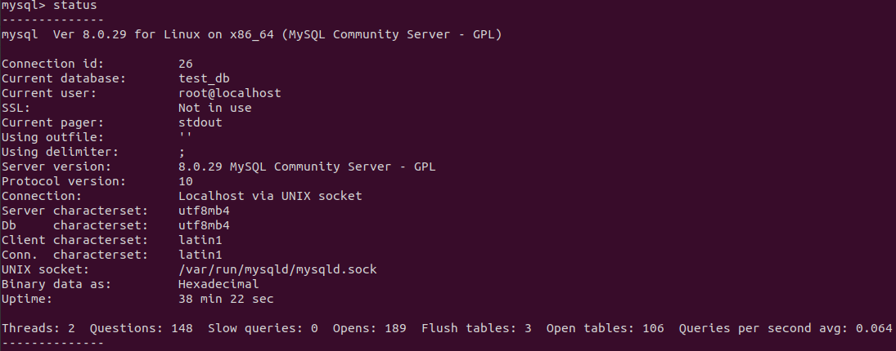
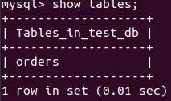
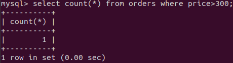
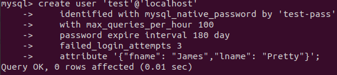
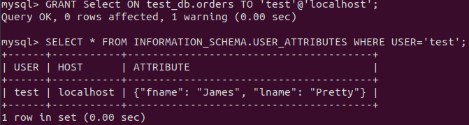
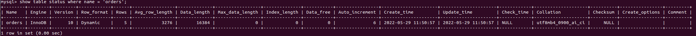
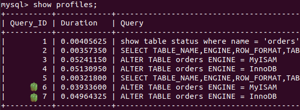
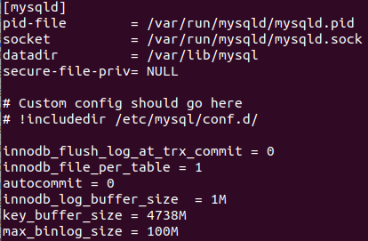

    Задача 1.
sudo docker pull mysql:8.0

sudo docker volume create vol_mysql

sudo docker run --name mysql-docker -e MYSQL_ROOT_PASSWORD=mysql -ti -p 3306:3306 -v vol_mysql:/etc/mysql/ mysql:8.0

root@105e7321d363:/etc/mysql# mysql -u root -p test_db < /etc/mysql/test_dump.sql

Статус БД:

Список таблиц:

Количество записей с price > 300:

    Задача 2.

    Задача 3.
mysql> SET profiling = 1;

InnoDB

mysql> ALTER TABLE orders ENGINE = MyISAM;

mysql> ALTER TABLE orders ENGINE = InnoDB;

    Задача 4.

root@eugene-Latitude-5491:/var/lib/docker/volumes/vol_mysql/_data# cat my.cnf

