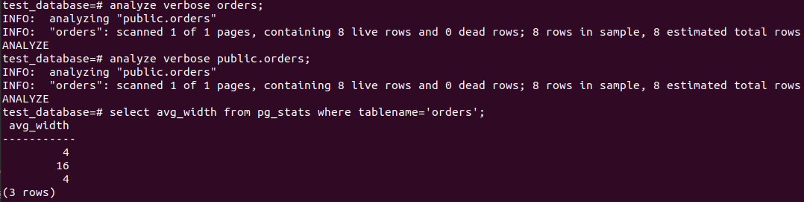

    Задача 1.

вывода списка БД - \l

подключение к БД - \c[onnect] {[DBNAME|- USER|- HOST|- PORT|-] | conninfo}

вывода списка таблиц - \dt[S+] [PATTERN]

вывода описания содержимого таблиц - \d[S+]  NAME

выхода из psql - \q

    Задача 2.

postgres=# CREATE DATABASE test_database;

postgres@416b2553820f:~/data$ psql -f test_dump.sql test_database

    Задача 3.

alter table orders rename to orders_old;

create table orders (id integer, title varchar(80), price integer) partition by range(price);

create table orders_1 partition of orders for values from (500) to (999999);

create table orders_2 partition of orders for values from (0) to (499);

insert into orders (id, title, price) select * from orders_old;

Да, можно. При изначальном проектировании таблиц можно было сделать ее секционированной.

    Задача 4.

postgres@416b2553820f:~/data$ pg_dump -d test_database > backup.sql

Для уникальности можно добавить индекс или первичный ключ.
    CREATE INDEX ON orders ((lower(title)));