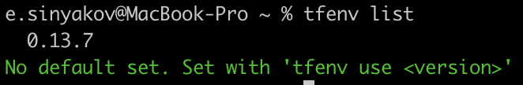
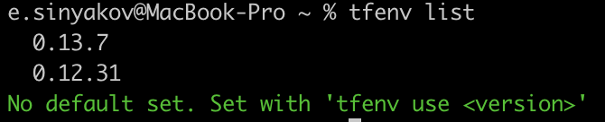

    Задача 1. 

1) Ответить на четыре вопроса представленных в разделе "Легенда".
    
    1.1) Будем использовать изменяемый тип инфраструктуры, так как будем использовать современные методы: облачные вычисления, виртуализацию.
    
    1.2) Не будем создавать единую точку отказа
    
    1.3) Для управления конфигурациями будем использовать chef-client. Для управления сервисами - consul agent
    
    1.4) Да, Chef и Consul.

2) Какие инструменты из уже используемых вы хотели бы использовать для нового проекта?
    
    Chef, Consul, Vault, GitLab, Github, ELK, Zabbix
	
3) Хотите ли рассмотреть возможность внедрения новых инструментов для этого проекта?

    Можем рассмотреть внедрение новых инструментов, например, дать волю командам на использование любых инструментов, которые помогут им работать. А плановые митинги дадут понимание о том, кто с чем работает и сможет поделиться позитивным или негативным опытом взаимодействия с тем или иным продуктом. Дальше если тот или иной инструмент покажет себя с лучшей стороны, то его можно будет внедрять в другие команды и проекты.

Для установки terraform буду использовать инструмент tfenv, поэтому приложу скриншот вывода из этого инструмента

      Задача 2.

      Задача 3.

