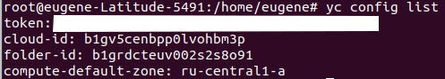

    Задача 1 (Вариант с Yandex.Cloud). Регистрация в ЯО и знакомство с основами (необязательно, но крайне желательно).

    Задача 2. Создание aws ec2 или yandex_compute_instance через терраформ.

1) Ответ на вопрос: при помощи какого инструмента (из разобранных на прошлом занятии) можно создать свой образ ami?

В яндекс cloud образы можно создавать с помощью packer.

2) Ссылка на репозиторий с исходной конфигурацией терраформа:

https://github.com/Phenom-55/devops-netology/tree/main/Terraform